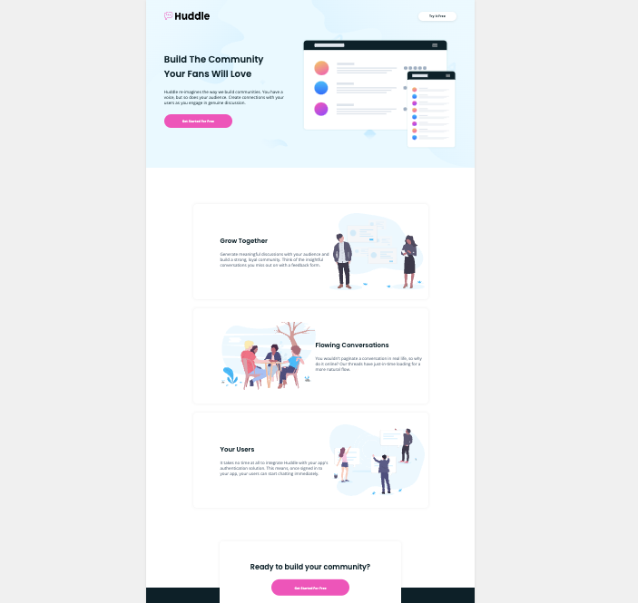

# Frontend Mentor - Huddle landing page with alternating feature blocks solution

This is a solution to the [Huddle landing page with alternating feature blocks challenge on Frontend Mentor](https://www.frontendmentor.io/challenges/huddle-landing-page-with-alternating-feature-blocks-5ca5f5981e82137ec91a5100). Frontend Mentor challenges help you improve your coding skills by building realistic projects. 

## Table of contents

- [Frontend Mentor - Huddle landing page with alternating feature blocks solution](#frontend-mentor---huddle-landing-page-with-alternating-feature-blocks-solution)
  - [Table of contents](#table-of-contents)
  - [Overview](#overview)
    - [The challenge](#the-challenge)
    - [Screenshot](#screenshot)
    - [Links](#links)
  - [My process](#my-process)
    - [Built with](#built-with)
    - [What I learned](#what-i-learned)
  - [Author](#author)

## Overview

### The challenge

Users should be able to:

- View the optimal layout for the site depending on their device's screen size
- See hover states for all interactive elements on the page

### Screenshot

### Links

- Solution URL: [Add solution URL here](https://your-solution-url.com)
- Live Site URL: [Add live site URL here](https://your-live-site-url.com)

## My process

### Built with

- Semantic HTML5
- BEM
- Sass
- 7-1 Sass Architecture

### What I learned

During this project I have learned how to better define my blocks and elements using BEM, resulting in code that is far more modular. For example, with the three feature blocks, I was able to define a `.feature-block` _block_, and then used _modifiers_ to change the order of image and text content `.feature-block--reverse`.

I have also learned to give a `max-width` and `margin-inline: auto` to a parent `
` in order to control the flow of the document at larger viewports.

## Author

-   Website - [Jake Godsall](https://jakegodsall.com)
-   Frontend Mentor - [@jakegodsall](https://www.frontendmentor.io/profile/jakegodsall)
-   LinkedIn - [@godsalljake](https://www.linkedin.com/in/godsalljake/)